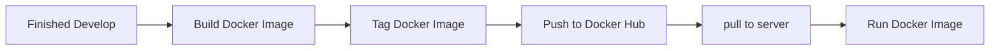

# SCMC WEBSITE

เว็บไซต์นี้เป็นเว็บไซต์ของ **ศูนย์บริหารจัดการเมืองอัจฉริยะ มหาวิทยาลัยเชียงใหม่ (SCMC)** ซึ่งรวมลิงค์ และบริการต่างๆทั้งหมดของมหาวิทยาลัยเชียงใหม่ไว้ในที่เดียว

## คุณสมบัติหลัก

- **Next.js 15.2.4:** ใช้ระบบ Routing ใหม่ล่าสุดของ Next.js เพื่อประสิทธิภาพที่ดียิ่งขึ้น
- **TypeScript:** เพิ่มความปลอดภัยในการเขียนโค้ดและลดข้อผิดพลาดด้วย TypeScript
- **Tailwind CSS:** จัดการ Style ได้อย่างรวดเร็วด้วย Utility-first framework
- **i18next:** รองรับการจัดการภาษาได้หลากหลายภาษา
- **MinIO:** สำหรับการเก็บ Object file
- **pgAdmin:** สำหรับการจัดการ Database
- **PostgreSQL:** เป็น Database หลักของ Project นี้

## 📖 เอกสารประกอบ (Documentation)

สามารถดูรายละเอียด และคำแนะนำเพิ่มเติมในเอกสารดังนี้

- **[การติดตั้งและรันโปรเจกต์](docs/installation.md)**
- **[คำแนะนำสำหรับการพัฒนา](docs/development.md)**
- **[เอกสารอ้างอิง API](docs/api-reference.md)**
- **[วิธีการ Deploy](docs/deployment.md)**
- **[สถาปัตยกรรมของโปรเจกต์](docs/architecture.md)**

## สคริปต์ที่ใช้บ่อย

- `npm run dev`: รันเซิร์ฟเวอร์ในโหมด Developer พร้อม Hot-reloading
- `npm run build`: สร้างโปรเจกต์สำหรับ Production
- `npm run start`: รันโปรเจกต์ที่ Build แล้วในโหมด Production
- `npm run lint`: ตรวจสอบและแก้ไขโค้ดที่ผิดตามหลัก ESLint

## การ Deploy

- ตอนนี้ Deploy ด้วยการใช้ Docker ด้วยวิธีดังนี้

